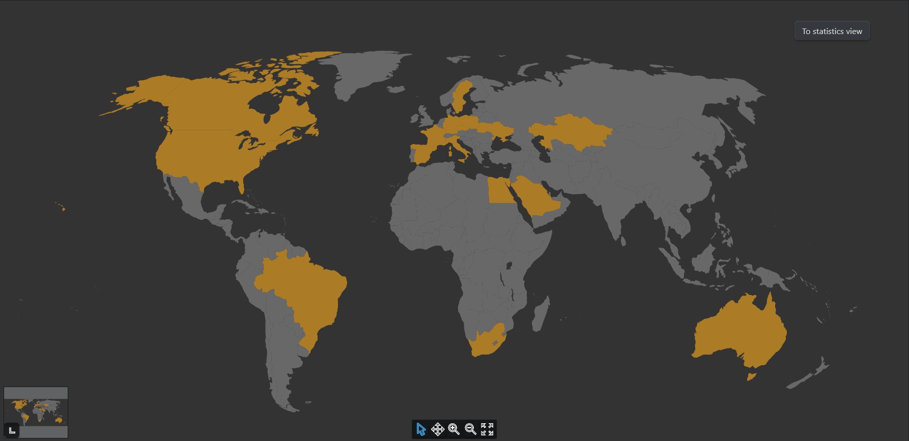
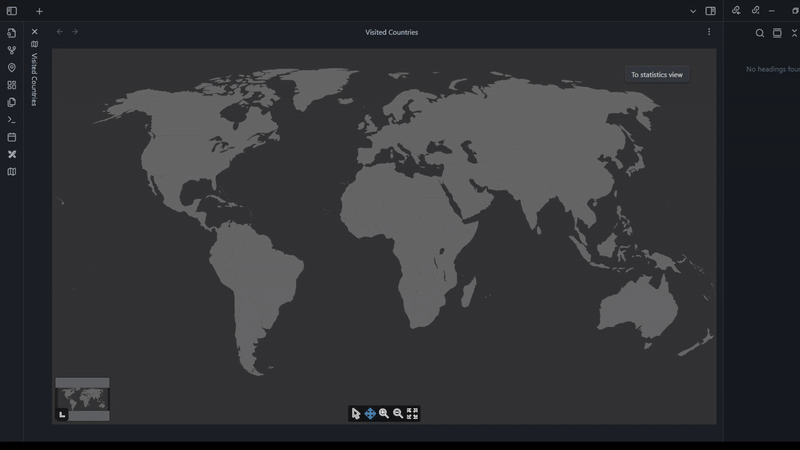
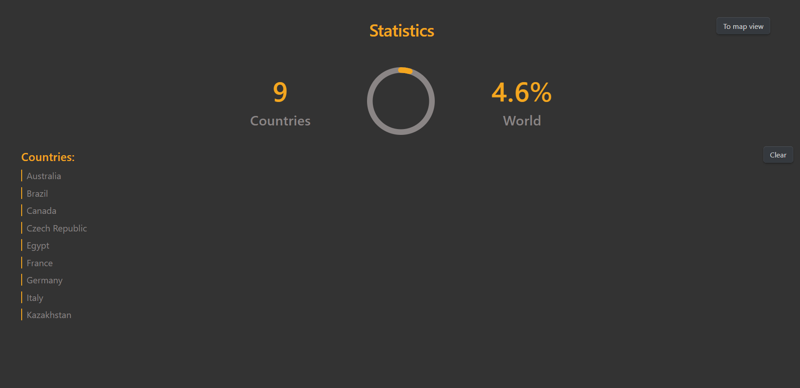

# Visited Countries Map — Obsidian Plugin

An Obsidian plugin that lets you mark and visualize the countries you've visited using an interactive world map, directly inside your vault.

---

## Features

- Interactive world map for selecting visited countries
- Built-in stats page with totals and coverage percentage
- Optional links from countries to notes or travel logs
- Mobile support — works on Obsidian for iOS and Android
- Fully local — no internet connection or external services required
- Simple, responsive design that blends into your workflow

---

## Demo

---

## Stats Page Preview

---

## Installation

1. Clone or download this repository as a ZIP archive.
2. Extract it into the `.obsidian/plugins/` directory inside your Obsidian vault.
	- If you've customized the name or location of your plugins folder in Obsidian settings, use that path instead.
3. Open Obsidian, go to **Settings → Community Plugins**, and enable the plugin.

Once enabled, you can launch the map from the command palette and begin marking countries.

